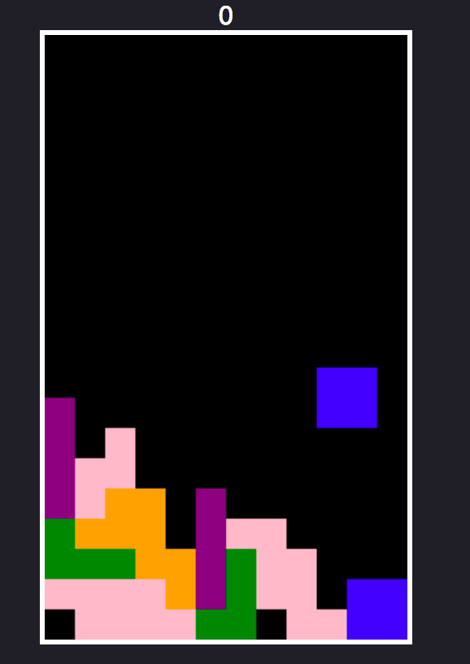

# Tetris in Javascript

## Introduction

This app was built by following the tutorial found [here](https://www.youtube.com/watch?v=H2aW5V46khA).

## Controls

- Use the arrow keys to move the pieces Left, Right and Down.
- Use the Up arrow to rotate the current piece.